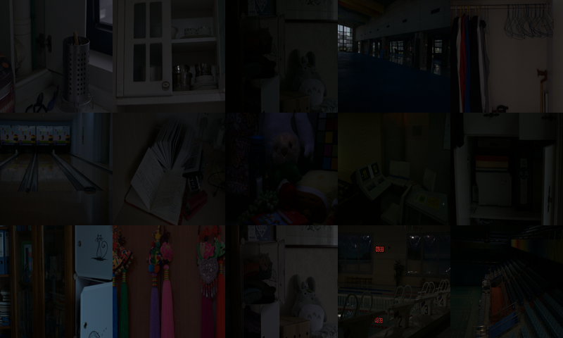
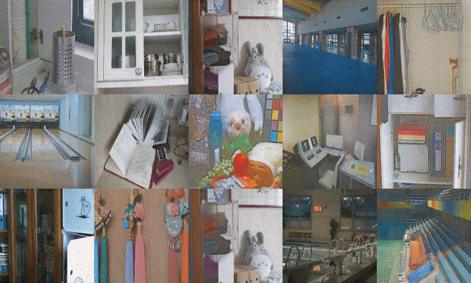

# [Diff-Retinex: Rethinking Low-light Image Enhancement with A Generative Diffusion Model](https://openaccess.thecvf.com/content/ICCV2023/papers/Yi_Diff-Retinex_Rethinking_Low-light_Image_Enhancement_with_A_Generative_Diffusion_Model_ICCV_2023_paper.pdf)

Xunpeng Yi, Han Xu, Hao Zhang, Linfeng Tang, and Jiayi Ma

CVPR 2023

This folder provides a re-implementation of this paper in PyTorch, developed as part of the course METU CENG 796 - Deep Generative Models. The re-implementation is provided by:
* Hamza Etçibaşı, hamza.etcibasi@metu.edu.tr 
* Enes Şanlı, sanli.enes@metu.edu.tr

## Experimental Results

### Low-light Images


### Normal-Light Images


### Ours (Reproduced)


Please see the jupyter notebook file [main.ipynb](main.ipynb) for a summary of the paper, the implementation notes, and our experimental results.

##  Dataset and Pre-trained Models

You can download dataset with running download_data.sh script
```ruby
chmod +x download_data.sh
./download_data.sh
```

You can download weights of models from these links:

[TDN Weights:]()

[Reflectance Map Diffusion Model Weights:](https://drive.google.com/file/d/1kQzemnfJLoTzqKjOIY09j893SsLvHTUw/view?usp=sharing)

[Illumination Map Diffusion Model Weights:](https://drive.google.com/file/d/1_0G09_rNPa7dYw4ud49yrn1EPwS_-Snb/view?usp=sharing)
